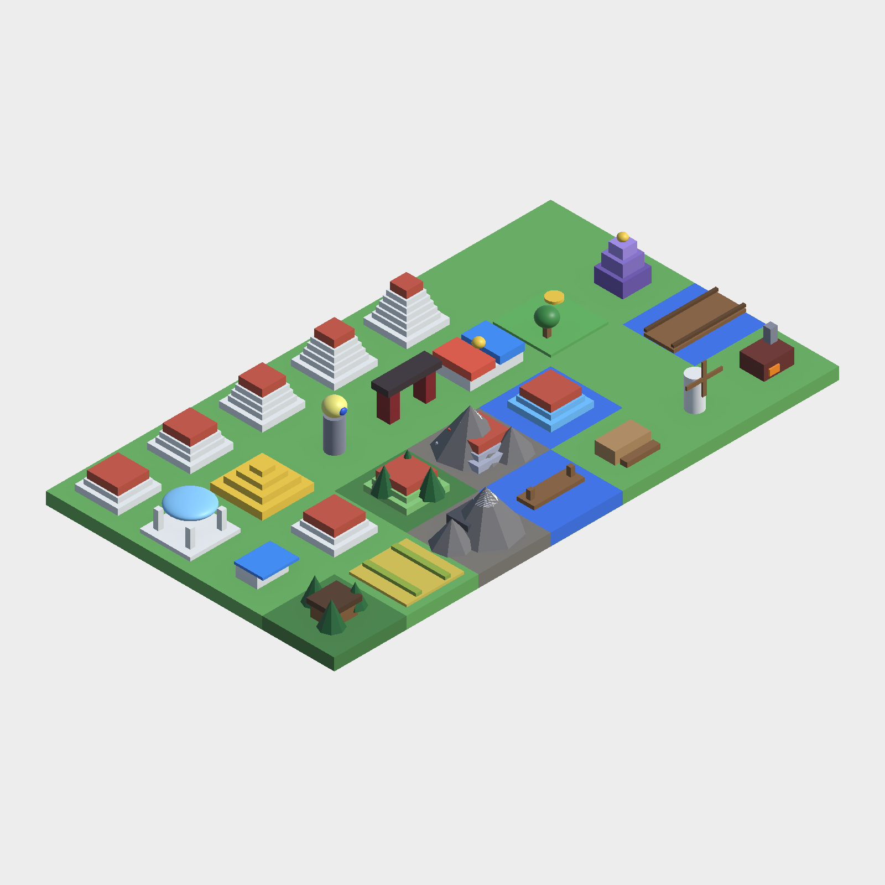
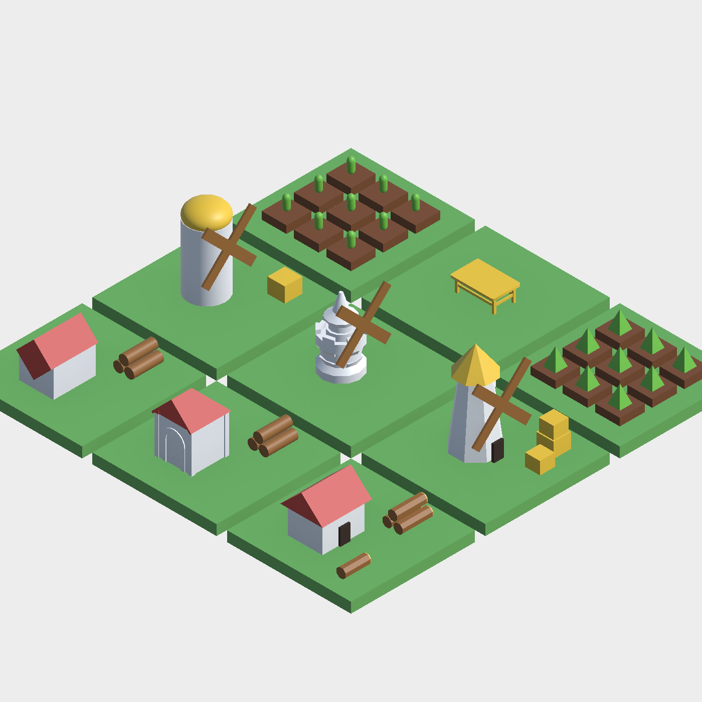
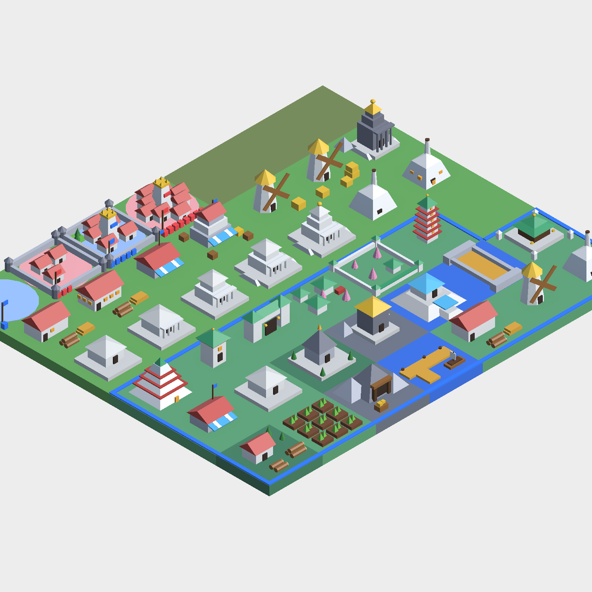
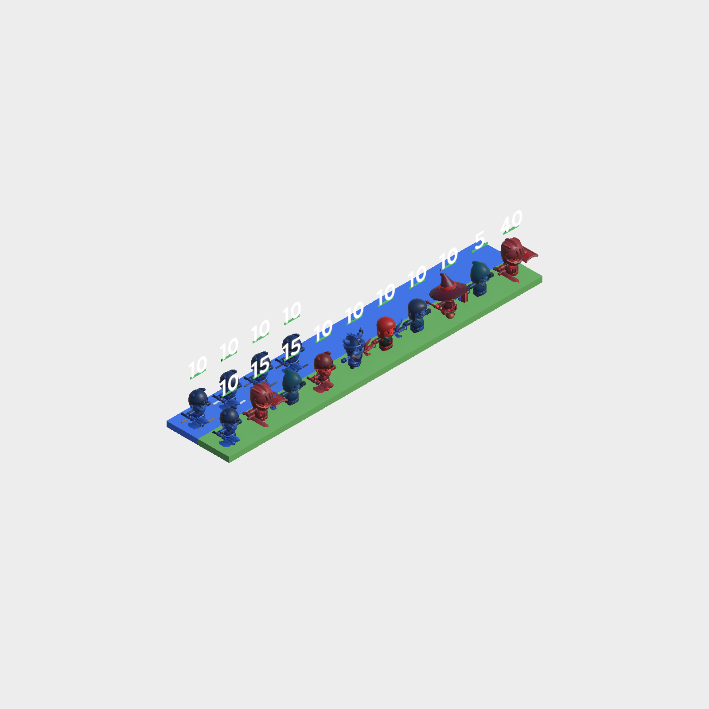
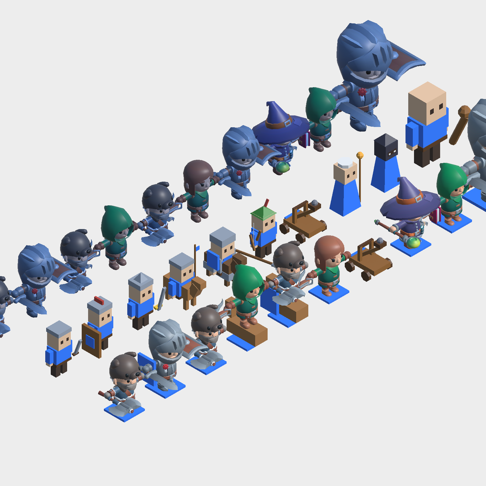
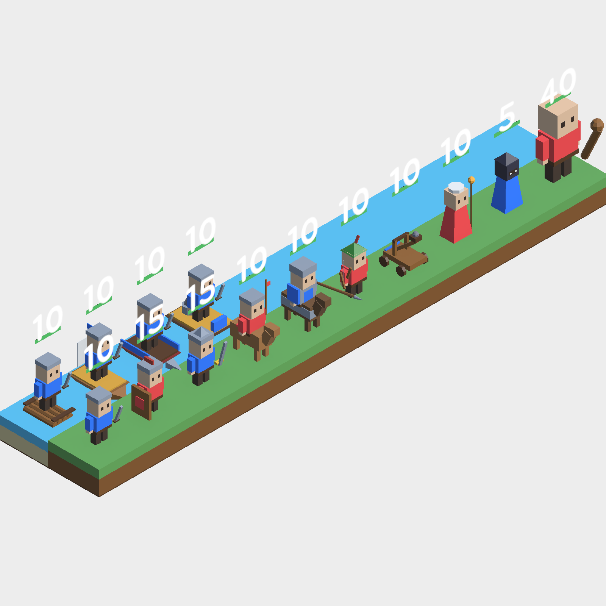
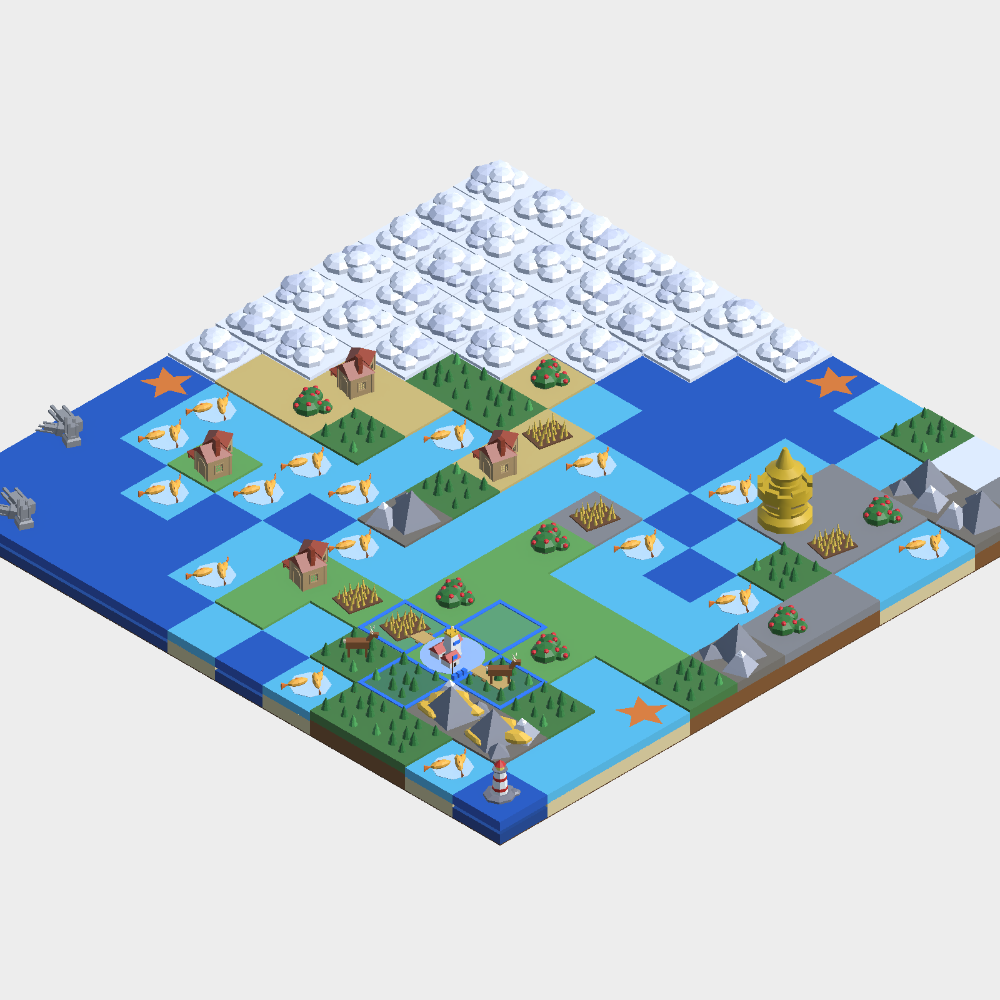

# 모델링 — 위키 대조 + 방식 비교분석 (3회 반복)

작성: 2026-09-27. 기준: [The Battle of Polytopia Wiki](https://polytopia.fandom.com/wiki/The_Battle_of_Polytopia_Wiki)의 도판
(Buildings/Terrain/List of Units 문서의 이미지 — 내장 브라우저로 이미지만 모아 보고 대조) + 문서 본문의 시각 묘사
(제재소 "창문 수 = 레벨", 대장간 "레벨 0은 불이 없다", 공방 "1레벨 대장간과 같은 모양", 성벽 "도시 둘레에 보인다" 등).

[게임 규칙 CSV](GameDataCsv.md)와 같은 방식으로 **위키 대조 → 방식 3개 비교 → 최적안 구현 → 스크린샷/지표로 개선**을 세 번 반복한다.

| 회차 | 대상 | 채택한 방식 | 상태 |
|---|---|---|---|
| 1차 | 건물 20종 + 도시(레벨/수도/성벽/공방/공원) | 모델 파츠 CSV + 저폴리 절차 메시(색별 병합) | ✅ |
| 2차 | 타일(지형) — 블록/물/숲/산/구름/도로 | 타일 파츠 CSV(받침 모델 + 지형 장식 + 도로 조각), 평평한 상자 윗면 | ✅ |
| 3차 | 유닛 10종 + 배 4종 | 파츠 CSV 블록 유닛(팀 색은 옷 조각에만), 탈것/기계/크기 | ✅ |

**측정 도구** — [`ModelShowcase`](../Assets/Editor/ModelShowcase.cs)(`unity run . -- -executeMethod TacticsECS.EditorTools.ModelShowcase.Run [-showcaseOut 폴더]`,
`-nographics` 없이): 건물/타일/유닛을 전투 화면과 같은 등각 구도(35.264°/45°)로 찍어 PNG로 저장하고, 모델별 렌더러 수·삼각형 수·
**실루엣 겹침**(64×64로 따로 찍은 윤곽의 IoU — 다른 건물과 가장 많이 겹치는 값이 낮을수록 한눈에 구분된다)을 `metrics.csv`로 남긴다.

---

## 1차 — 건물과 도시

### 1-1. 위키 대조 (1차 전 인게임)

| 항목 | 위키 도판 | 인게임(1차 전) |
|---|---|---|
| 벌목장 | 흰 벽 + 빨간 박공지붕 오두막 + 노란 단면 통나무 더미 | 갈색 상자 + 판 |
| 제재소 | 더 큰 흰 집 + 빨간 지붕 + 판자·통나무, **창문 수 = 레벨** | 긴 갈색 상자 2개, 레벨 없음 |
| 농장 | 흙두둑 격자 + 새싹 | 노란 판 + 줄 2개 |
| 풍차 | 흰 원뿔대 탑 + 노란 원뿔 지붕 + X자 날개 + 건초 | 흰 원통 + 막대 2개 |
| 광산 | 회색 바위 사이 나무틀 갱도 + 금광석 | 회색 상자 + 청록 상자 |
| 대장간 | 흰 뿔대 + 굴뚝 + 불빛 창(**레벨 0은 불 꺼짐**) | 적갈색 상자 |
| 시장 | 돌 건물 + 기와지붕 + 파란 줄무늬 차양 + 깃발, 레벨이 오르면 커짐 | 흰 상자 + 파란 판 |
| 항구 | 누런 판자 부두 + 작은 배 | 갈색 판 |
| 신전 4종 | 흰/회색 계단식 신전, 레벨이 오르면 층·기둥·금 장식, 종류마다 모양이 다름 | 색만 다른 층층 상자 |
| 다리 | 돌 난간 + 누런 상판 + 교각 | 갈색 판 + 난간 |
| 기념물 7종 | 흰 몸체 + 초록 기와 + 금 장식(부족별) | 원색 도형 조합 |
| 도시 | **레벨이 오를수록 건물이 늘어남**, 수도 성(좁은 사각뿔 + 왕관), **성벽이 도시 둘레**, 공방/공원이 건물 사이에 보임 | 팀색 원판 + 레벨 눈금만(마을 구조물 그대로) |
| 숲/산 위 건물 | 건물이 그 칸을 차지 | 나무/산 장식과 겹쳐 파묻힘 |

### 1-2. 방식 비교 — 벌목장/풍차/농장 시제품

같은 세 건물을 세 방식으로 만들어 같은 구도로 찍었다(아래 그림 — 뒷줄 A, 가운데 B, 앞줄 C).

| 방식 | 위키 특징 재현(3건물 9개 항목) | 렌더러(합) | 삼각형(합) | 모양 하나 바꾸는 비용 | 에셋 |
|---|---|---|---|---|---|
| **A** Unity 기본 도형(큐브/원기둥/구/캡슐) 코드 표 — 현행 방식 개선 | ≈6 — 원뿔·박공이 없어 풍차 지붕이 구, 탑이 원통, 박공은 45° 돌린 큐브가 몸체를 뚫음 | 30 | 8,768(캡슐 새싹) | C# 수정 + 재컴파일 | 없음 |
| **B** Kenney 모듈 키트 조립(가져온 벽/지붕/성탑/좌판) | ≈3.5 — 오두막은 좋지만 풍차 탑·밭 부품이 키트에 없어 성탑·좌판으로 대체 | 15 | 2,246 | 굽기 스크립트 수정 + 재실행, 없는 부품은 **추가 다운로드 필요** | CC0 외부 |
| **C** 모델 파츠 CSV + 저폴리 절차 메시(박공/사각뿔/원뿔/원뿔대/절두체), 색별 병합 | **9** | **3** | **626** | **CSV 칸 하나**(재컴파일 없음) | 없음 |

- A는 도형 종류가 모자라 위키 실루엣(원뿔 지붕, 박공지붕, 뾰족 신전)을 못 만든다. 조각마다 렌더러라 무겁다.
- B는 부품이 있는 건물만 좋고 스타일도 폴리토피아(면 단위 단색)보다 사실적이다. 없는 부품마다 다운로드가 필요하다.
- **결정: C.** 폴리토피아 도판은 단색 저폴리 도형의 조합이라 도형 8종(상자/박공/사각뿔/원뿔/원기둥/원뿔대/구/절두체)으로 거의
  그대로 옮겨진다. 조각을 색별로 합쳐 **모델 하나 = 렌더러 1개**. 게임 규칙 CSV와 같은 규칙(헤더 이름 기반, `#` 주석, `파일:줄` 경고)으로
  읽혀 기획자가 스프레드시트에서 모양/색을 고칠 수 있다. 레벨 조각(`MinLevel`/`MaxLevel`)으로 위키의 "레벨이 오르면 바뀌는 모양"도 표현.

### 1-3. 형식

**`Assets/Resources/Models/ModelPalette.csv`** — `Name,Color`(#RRGGBB). 색을 이름으로 쓰면 한 곳만 고쳐 모든 모델의 지붕색 등이 바뀐다.

**`Assets/Resources/Models/BuildingModels.csv`** — 한 행 = 조각 하나([`ModelPartInfo`](../Assets/Scripts/TacticsECS/Core/ModelPartInfo.cs))

| 컬럼 | 의미 |
|---|---|
| `Model` | 모델 Id(`Building.<건물 Id>`, `City.Houses`/`Capital`/`Wall`/`Workshop`/`Park`/`Flag`). **비우면 윗 행과 같은 모델** |
| `Shape` | `Box` `Gable`(용마루가 X축) `Pyramid` `Cone` `Cylinder` `Tapered`(윗면 60%) `Sphere` `Frustum`(사각 절두체) |
| `X,Y,Z` | 도형 **바닥 중심** 위치(타일 로컬 — 한 변 1, 타일 윗면 y=0). 카메라는 -X/-Z 쪽에서 보므로 문·창은 그쪽 면에 |
| `SX,SY,SZ` | 크기(`SZ` 비우면 `SX`) |
| `RX,RY,RZ` | 회전(도) — 통나무는 `RZ=90`, 풍차 날개는 `RZ=45/135/...` |
| `Color` | 팔레트 이름, `#RRGGBB`, 또는 `Team`(주인 팀 색 — 깃발) |
| `MinLevel`/`MaxLevel` | 이 레벨 범위에서만 보이는 조각(0/빈칸 = 제한 없음) |

표시 레벨은 [`TileImprovementSystem.DisplayLevel`](../Assets/Scripts/TacticsECS/Systems/TileImprovementSystem.cs): 신전 = 지은 뒤 지난 턴(1~5),
제재소/풍차/대장간 = 인접 기반 건물 수(0이면 위키의 레벨 0), 시장 = 인접 가공 건물 인구 합(최대 8). 조립은
[`ModelBuilder`](../Assets/Scripts/TacticsECS/View/ModelBuilder.cs)(색별 서브메시 병합, (모델, 레벨)마다 메시 캐시), 도형은
[`LowPolyMeshes`](../Assets/Scripts/TacticsECS/View/LowPolyMeshes.cs)(면마다 정점 분리 → 각진 음영).

### 1-4. 결과와 개선

(위: 1~3줄 건물 20종, 4~5줄 레벨 변화 — 신전 Lv1~5, 대장간 Lv0/4, 제재소 Lv1/6, 시장 Lv1/8, 풍차 Lv1/4, 산악 신전 Lv5, 6줄 도시 Lv1 / Lv3+성벽 /
Lv5 수도+공방+공원+성벽 / Lv8 수도)

| 지표(건물 20종) | 1차 전 | 1차 후 |
|---|---|---|
| 렌더러 | 66 | **20** |
| 삼각형 | 5,532 | 3,314 |
| 실루엣 최대 겹침 평균 / 최악 | (측정 도구 버그로 미측정 — 아래) | 0.676 / 0.877 |

- **개선 1 — 측정 버그**: 첫 측정에서 모든 건물의 실루엣 겹침이 1.0이었다. 실루엣용 모델을 원점에 세워 격자 타일까지 같이 찍혔던 것 —
  측정 위치를 격자에서 먼 곳으로 옮겨 고쳤다.
- **개선 2 — 신전 4종 구분**: 고친 측정에서 신전 4종이 레벨 1에서 겹침 0.99(색만 다름)로 나왔다. 위키 도판대로 숲 신전 = 좁고 뾰족한 지붕 +
  금빛 불꽃, 산악 신전 = 높은 돌탑, 해양 신전 = 넓은 계단 기단으로 비율을 갈라 최악 겹침을 0.99 → 0.88로 낮췄다.
- **개선 3 — 도시 원판**: 팀색 원판이 도시를 덮어 튀었다(위키엔 없음). 옅은 테두리로 바꾸고 주인은 팀색 깃발 + 국경선으로 보이게 했다.
- 도시 칸은 도시 모델이 마을/수도 구조물을 대신하고, 숲/산 위 건물은 자기 지형 장식(작은 나무, 바위)을 포함해 원래 장식을 숨긴다.
- **2차로 넘긴 점**: 도로는 여전히 타일 색(올리브)뿐이다(위키: 누런 점선 길). 타일이 얇은 판이라 건물이 "블록 위"가 아니라 "판 위"에 선 느낌 —
  2차(타일)에서 다룬다.

---

## 2차 — 타일(지형)

### 2-1. 위키 대조 (Terrain 문서 도판)

| 항목 | 위키 | 인게임(2차 전) |
|---|---|---|
| 땅 타일 | 풀 윗면 + **두꺼운 흙 옆면** 블록(경사 없음) | 얇은 Kenney 타일(모서리 경사), 옆면도 풀색 |
| 얕은 물 | 밝은 청록, 땅보다 낮고 **모래 바닥이 비침**(옆면 = 물층 + 모래층) | 파란 판, 땅과 같은 높이 |
| 깊은 바다 | 짙은 파랑 | 짙은 파랑 판 |
| 숲 | 작은 침엽수 **여러 그루**(9그루 안팎) | 원뿔 나무 3그루 |
| 산 | 회색 다면 봉우리 + 눈 | 원뿔 봉우리 + 눈(비슷함) |
| 산 + 금속 | **금빛** 광석 | 청록 결정 |
| 구름 | 울퉁불퉁한 **흰 덩어리** | 평평한 옅은 칸 |
| 도로 | 이웃 도로/도시와 **이어지는 길** | 타일 색만 올리브로 |

### 2-2. 방식 비교 — 같은 생성 맵(대륙형 12×12, 시드 1)

| 방식 | 그림 | 위키 항목(8) | 렌더러 | 삼각형 | 기존 코드 영향 |
|---|---|---|---|---|---|
| **A** 현행 — 타일 메시 1장 + 색 틴트, 장식은 코드 원뿔 | [A](images/modeling/r2_map_A_before.png) | 2 | 752 | 30,386 | — |
| **B** 타일 파츠 CSV — 윗면(TileView가 칠함) + 받침 모델(흙/모래/짙은 바닥) + 숲·산·구름·도로 파츠 | [B](images/modeling/r2_map_B_after.png) | **8** | 851 | 50,246 | GridView만(타일마다 자식 모델 추가) |
| **C** 맵 청크 메시 — 모든 타일을 정점색 메시 하나로(윗면 + 옆면) | [C](images/modeling/r2_map_C_chunk.png) | 3(땅 옆면·물 높이·모래) | **1**(타일만) | 864(타일만) | 큼 — 하이라이트/영토색을 정점색으로, 타일 자식(구조물/건물/유닛 위치) 구조 전부 교체 |

- C는 가장 가볍지만, 정점색을 쓰는 URP 셰이더(Particles/Simple Lit)라 색이 바래고 다른 모델(Lit)과 조명이 어긋났다. 타일 GameObject에
  기대는 하이라이트·구조물·건물·경계선 코드를 모두 바꿔야 한다. 12×12~16×16 맵에서 타일 렌더러 수는 병목이 아니다.
- **결정: B.** 1차와 같은 파츠 CSV 파이프라인을 그대로 써서 위키 항목 8개를 모두 채우고, 렌더러 증가(+13%)는 받침 모델 1개/타일 수준.

### 2-3. 형식

**`Assets/Resources/Models/TerrainModels.csv`** — 1차와 같은 컬럼.
`Tile.Land`/`Tile.Shallow`/`Tile.Ocean`(윗면 아래 받침), `Terrain.Forest`(소나무 9그루)/`Terrain.Mountain`/`Terrain.Cloud`,
`Road.Center` + `Road.Arm`(-Z 방향 팔 — 이웃 도로·다리·도시 방향마다 코드가 90°씩 돌려 붙인다). 윗면은 경사 없는 저폴리 상자(두께 0.2),
물 칸은 0.05 낮춘다(받침 바닥은 땅과 맞춤). 색은 1차 팔레트에 흙/모래/바위/눈/구름/흙길 색을 추가.

### 2-4. 개선

- **반투명 물 → 불투명**: 처음엔 위키처럼 물 윗면을 반투명으로 해 모래가 비치게 했는데, 이웃 물 칸의 옆면이 비쳐 칸마다 테두리 격자가
  생겼다(그리고 Kenney 타일 모서리 경사면도 비쳤다). 위키 얕은 물의 옆면이 "청록 물층 + 모래층" 두 줄이라는 점에 착안해 불투명 청록
  윗면 + 모래 받침으로 같은 모습을 냈다 — 투명 정렬 문제와 빌드 시 투명 셰이더 변형이 빠질 위험도 사라졌다.
- **경사 타일 → 평평한 상자**: Kenney 타일 메시의 모서리 경사가 위키 블록과 다르고 물에서 격자로 보여 저폴리 상자로 통일(땅↔물 전환 시
  높이/색만 바꾼다). `landTilePrefab`/`waterTilePrefab` 인자는 호환을 위해 남겼지만 쓰지 않는다.
- **금속 = 금빛**: `StructureAssetSetup`의 광석 색을 청록 → 금색으로. 이때 발견한 버그 — 머티리얼 에셋이 이미 있으면 색 상수를 바꿔도
  재사용돼 반영되지 않았다 → 기존 에셋의 색도 갱신하게 수정.
- 도로 틴트 제거(흙길 모델로 대체), 영토 색 섞을 때 알파 보존.
- **3차로 넘긴 점**: 유닛이 모두 같은 크기의 사람형 + 전신 팀색 틴트라 위키(큐브형, 기병/기사는 탈것, 투석기는 기계, 거인은 큼)와 다르고,
  배는 발밑의 얇은 판이라 거의 안 보인다.

---

## 3차 — 유닛

### 3-1. 위키 대조 (List of Units 도판)

| 항목 | 위키 | 인게임(3차 전) |
|---|---|---|
| 몸 | **큐브 머리 + 상자 몸**(블록형), 부족 색은 옷에 | KayKit 사람형(둥근 비율), **전신에 팀색을 곱해** 어둡고 디테일이 묻힘 |
| 기병 / 기사 | **탈것 위** 기수, 기사는 긴 창 + 방패 | 서 있는 사람(기사는 해골 전사 모델) |
| 투석기 | **바퀴 달린 목제 기계** | 원거리 사람 모델 |
| 방어병 / 궁수 / 검사 | 큰 방패 / 활 + 모자 / 긴 칼 + 투구 | 모델 7종 돌려쓰기(보병·기병 같은 모델) |
| 마인드 벤더 / 망토 | 로브 + 빛나는 지팡이 / 두건 망토 | 마법사 / 두건 사람 |
| 거인 | 체력 40 — **다른 유닛보다 훨씬 큼** | 방어병 모델 그대로(같은 크기) |
| 배 | 뗏목(통나무 + 돛) / 정찰선(돛단배) / 충각선(붉은 배 + 충각) / 폭격선(큰 배 + 박격포) | 발밑의 얇은 색 판(거의 안 보임) |

### 3-2. 방식 비교 — 위키 유닛 10종, 같은 구도

 (뒷줄 A, 가운데 B, 앞줄 C)

| 방식 | 렌더러(10종) | 삼각형 | 실루엣 최대 겹침 평균 / 최악 | 팀색 픽셀 비율 | 위키 특징 |
|---|---|---|---|---|---|
| **A** KayKit 유지 + 개선(외형 재배정, 틴트 50% 완화, 거인 1.5배) | 91 | 51,639 | 0.910 / **1.000**(같은 모델 재사용) | 0.495(전신 틴트) | 크기만 |
| **B** 파츠 CSV 블록 유닛 — 큐브 몸, `Team` 색 옷 조각, 무기·모자·탈것·기계 | **10** | **2,038** | **0.807 / 0.926** | 0.288(옷) | 탈것·기계·방패·활·창·로브·망토·크기 |
| **C** 혼합 — KayKit(원래 텍스처) + 소품(탈것/방패) + 팀색 받침 | 97 | 46,821 | 0.802 / 1.000 | 0.191(받침만) | 탈것(비율 어긋남) |

- A는 모델이 7종뿐이라 10종 중 두 쌍이 실루엣이 완전히 같고(겹침 1.0), 전신 틴트는 팀은 잘 보이지만(0.5) 얼굴·장비까지 파랗게 덮는다.
- C는 KayKit(키 약 1.4)과 소품의 비율이 맞지 않고(말 위에 선 사람), 팀 색이 받침에만 남아 식별이 가장 약하다.
- **결정: B.** 1·2차와 같은 파이프라인. 팀 색이 옷(몸통/팔/깃발/방패 문양)에만 칠해져 얼굴·장비는 제 색을 유지하면서도 팀이 읽히고,
  렌더러 1개/유닛, 삼각형은 A의 4%. KayKit 모델은 애니메이션을 쓰지 않고 있어 잃는 것이 없다.

### 3-3. 형식

**`Assets/Resources/Models/UnitModels.csv`** — 1·2차와 같은 컬럼. 좌표는 유닛 발밑 원점·월드 단위(타일 한 변 1.2)·**정면 -Z**.
`Unit.<유닛 CSV Id>`(보병/방패병/검투사/기병/기사/궁병/투석기/사제/스파이/거인), `Boat.<배 Id>`(raft/scout/rammer/bomber).
`Team` 색 조각 = 옷. [`UnitDefinition.modelId`](../Assets/Scripts/TacticsECS/View/UnitDefinition.cs)가 모델을 고르며, CSV 유닛은 스폰 때
`Unit.<Id>`로 덮어쓰고 SampleScene 기본 프리팹 7종은 대응 위키 유닛(근접 = 보병, 원거리 = 궁병, 방어 = 방패병 ...)을 가리킨다.
[`UnitView`](../Assets/Scripts/TacticsECS/View/UnitView.cs)는 모델이 있으면 KayKit 모델을 끄고 블록 모델을 타일 윗면 높이에 세운다. 방어 태세는
옷 색을 노랗게 바꿔(모델 재조립) 표시하고, 배에 타면 `Boat.*` 모델 갑판 위로 올라선다.

### 3-4. 개선

- **파묻힌 발**: 첫 촬영에서 다리가 짧아 보였다 — 2차에서 타일 윗면을 두께 0.2 상자로 바꾼 뒤 유닛 루트 높이(0.05)는 그대로라 블록 모델이
  0.15 파묻혀 있었다. `GridView.TileTopHeight`/`WaterDrop`을 공개 상수로 올려 `UnitView`가 그 높이에 모델을 세우게 했다.
- **뗏목 통나무 치우침**: `RX=90` 원기둥은 기준점에서 +Z로 뻗는다는 점을 놓쳐 통나무가 칸 밖으로 나갔다 → 시작 위치를 -0.35로.
- **배 선체가 수면 아래**: 뒤집은 절두체 선체가 수면 밑이라 갑판 판만 보였다 → 선체를 갑판에서 아래로 좁아지며 수면 위로 드러나게.
- **탈것 비율**: 말을 키우고 기수를 말 등 높이(0.46)로 올려 "파묻힌 기수"를 고쳤다.

---

## 3회 반복 요약

| | 1차 건물 | 2차 타일 | 3차 유닛 |
|---|---|---|---|
| 채택 | 파츠 CSV + 저폴리 절차 메시 | 같은 파이프라인 + 받침/장식/도로 | 같은 파이프라인 + 팀색 옷/탈것/배 |
| 대표 지표 | 건물 렌더러 66 → 20 | 위키 항목 2 → 8 (맵 렌더러 +13%) | 유닛 렌더러 91 → 10, 삼각형 51,639 → 2,038 |
| 개선에서 잡은 것 | 실루엣 측정 버그, 신전 4종 구분, 도시 원판 | 반투명 물 격자, 경사 타일, 광석 색 + 머티리얼 갱신 버그 | 파묻힌 발, 뗏목 기준점, 수면 아래 선체, 탈것 비율 |

남은 과제: 부족(tribe)별 색·장식(위키는 부족마다 모자·집 모양이 다름) — 지금은 팀 색 하나. 유닛 애니메이션(이동 시 흔들림 등)은 없다.
HP 표시 높이(1.7)는 KayKit 키에 맞춘 값이라 블록 유닛(키 약 1.0) 위로 조금 높게 뜬다(UI 프리팹 재생성이 필요해 그대로 둠).
