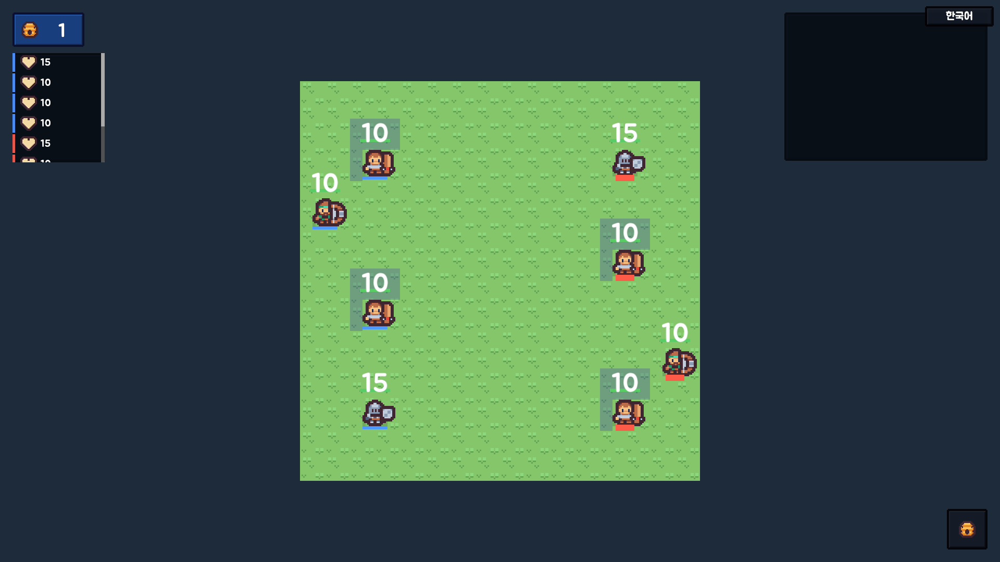
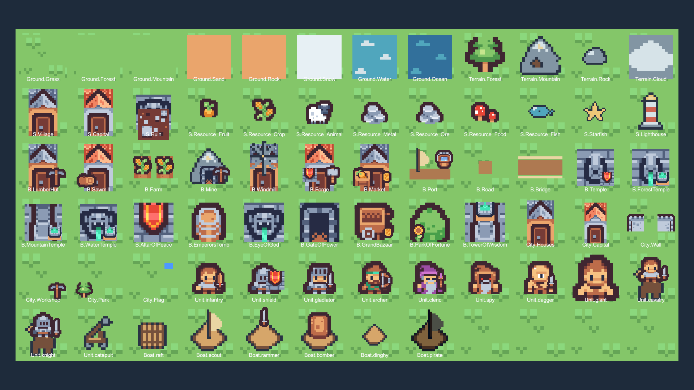
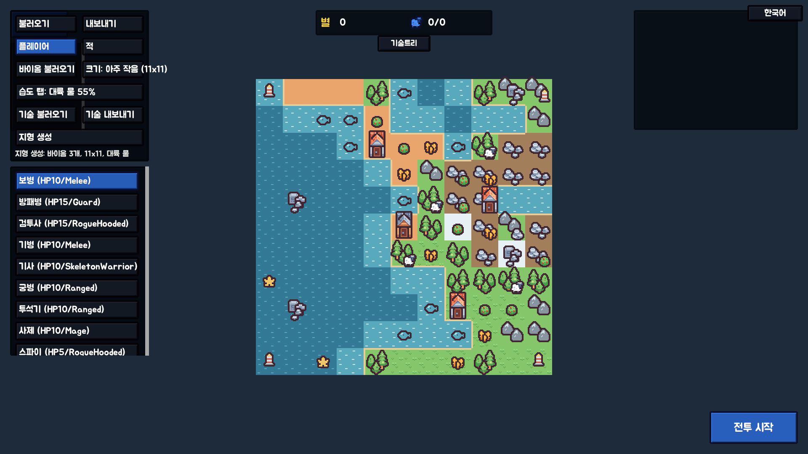

# 2D 픽셀 전환 구현 기록

2026-10-01. Unity 6000.3.20f1. 기존 전투·경제·기술·맵 생성 규칙을 유지하고 활성 게임 화면을 탑다운 2D로 전환했다.

## 화면과 에셋





- 무료 CC0 원본: [Kenney Tiny Town](https://kenney.nl/assets/tiny-town), [Tiny Farm](https://kenney.nl/assets/tiny-farm), [Tiny Dungeon](https://kenney.nl/assets/tiny-dungeon), [UI Pack - Pixel Adventure](https://kenney.nl/assets/ui-pack-pixel-adventure).
- 원본·다운로드 출처·LICENSE는 `Assets/Art/Pixel2D/ThirdParty/Kenney/<pack>/`에 보관했다. 실제 런타임은 `Assets/Resources/Pixel2D/Sheets`의 공유 packed sheet 3장과, `scripts/author_pixel_ui.py`로 만든 UI 틀 3장(Panel·Button·Badge)을 사용한다.
- 121개 표시 키, 167개 스프라이트 레이어를 `SpriteCatalog.csv`에 등록했다. 평지/숲/산/모래/암석/눈/물/바다, 구조물 12종(구 자원 ID 포함), 현재 건물 21종, 도시 장식, 육상 11종, 함선 6종, 기본 행동·패시브·기술 아이콘을 포함한다.
- 기병의 말, 투석기, 선체·돛, 산·바위·물·구름, 물고기·불가사리·등대, 간단한 UI 도형은 새로 작성한 코드 기반 픽셀 패턴으로 보완했다. 완성된 무료 그림의 1:1 대체로 전부 해결한 것은 아니다.
- 스프라이트의 조합·크기·색·레벨 조건은 CSV에서 수정할 수 있다. 여러 레이어는 별도 행이며 한 칸에는 값 하나만 넣는다. 새 패턴은 `Patterns/<name>.txt`에 팔레트(`문자=색상 HEX`)와 픽셀 행을 작성한다.
- 이전 3D 모델 원본과 모델 CSV는 비교·기존 문서용으로 보존했다. 활성 유닛·구조물·타일 프리팹의 FBX 참조와 유닛 BodyTexture 참조를 제거했다. 이전 GameIcons는 `LegacyIcons`로 옮겨 Resources 자동 포함을 해제했다.

## 구조와 동작

- `SpritePartInfo`: 값만 담는 표시 데이터. 게임 규칙 Systems에는 새 상태를 추가하지 않았다.
- `PixelSpriteCatalog`: 표시 계층의 CSV 로드·Sprite 캐시·레이어 조립. 텍스처는 Point, mipmap 없음, 압축 없음. 공유 Unlit 머티리얼을 사용한다.
- `PixelCoordinates`: 논리 그리드의 XZ 좌표는 유지하고 표시 좌표만 XY로 투영한다. 배치·전투·호버가 동일한 역변환을 사용한다. 반 칸 경계는 한쪽만 포함하도록 처리했다.
- `PixelCamera`: 정면 직교 카메라, 정수 픽셀 배율과 위치 스냅. 기존 WASD/방향키 팬과 휠 줌을 연결했다. 정수 배율이므로 줌이 단계적으로 변한다. 화면 크기에 따라 보이는 범위가 조금 달라질 수 있다.
- `GridView`: 공유 지면·시야 Tilemap 2개, 숲·산·해안선, 도로 연결, 다리 방향, 자원·건물·도시 표시. 미탐험 상태에서 표시를 새로 만들어도 계속 숨긴다. 기존의 전체 경제 표시 갱신 방식은 유지했다.
- `UnitView`: 픽셀 몸체·팀 배지·방어/빙결/은신 배지, HP 막대·숫자, 이동·방향 표시, 짧은 공격 모션·피격 색 변화·피해 팝업. 팀 배지는 색과 두께를 함께 구분한다. 승하선·함선 업그레이드는 Sprite 레이어를 교체한다.
- 사용자 정의 유닛 CSV의 ID가 카탈로그에 없으면 지정한 BaseVisual의 픽셀 외형을 사용한다. 기본 게임 항목은 모두 전용 키가 있다. 사용자 정의 기술/구조물의 미등록 표시 키는 진단 로그와 물음표 Sprite로 드러낸다.
- 도시 레벨은 추가 집·레벨 눈금으로, 성벽·수도·공방·공원은 별도 레이어로 표현한다. 현재 눈금은 최대 8개까지 표시한다. 모든 레벨의 독립 그림이나 방향별 걷기 애니메이션을 새로 제작하지 않았다.
- 기존 한국어 Jua 폰트와 버튼·툴팁·기술트리·CSV 불러오기 흐름을 유지했다. UI 프리팹은 픽셀 패널·버튼으로 변경하고, HUD 초기화 시 동적 요소에도 스킨을 적용한다.
- URP는 기존 렌더러에서 Unlit Sprite를 사용한다. 별도 2D Renderer, 물리 엔진, 신규 패키지 설치 없이 전환했다.

## 도구와 검증

CLAUDE.md에 따라 에디터가 닫혀 있음을 확인하고 Unity CLI로 실행했다.

```powershell
unity run . -- -nographics -logFile Logs/pixel2d_setup.log -executeMethod TacticsECS.EditorTools.Pixel2DSetup.Run
unity run . -- -logFile Logs/pixel2d_verify.log -executeMethod TacticsECS.EditorTools.Pixel2DVerification.Capture
unity run . -- -nographics -logFile Logs/pixel2d_build.log -executeMethod TacticsECS.EditorTools.Pixel2DBuild.Run
```

`Pixel2DSetup`은 임포트 설정·파생 Sprite·2D 프리팹·UI·양 씬을 갱신한다. 유닛 스탯/행동과 프리팹 GUID·폰트·씬 연결은 보존한다. 구조물 프리팹은 카탈로그 기준으로 다시 구성하므로, 수동 외형 변경은 먼저 카탈로그에 반영해야 한다. 기존 3D 전용 생성 도구는 역사적 자료로 남아 있으며 재실행하면 해당 프리팹을 덮어쓸 수 있다.

통합 검증은 모든 기본 표시 키·레이어, 카메라 팬/줌/원점/셀 경계 클릭 좌표, 시야 상태에서 자원·건물·도로 재생성, 채집·벌목 표시 제거, 11종 육상 유닛, 6종 함선 교체와 하선, 팀 전환·방어·사망, 활성 프리팹 FBX 의존 제거, 최대 30×30 맵을 확인한다.

Play 모드 검증은 CLI 배치 에디터에서 실제 Start/Update/코루틴을 실행하여 샌드박스 시작 → 유닛 CSV 불러오기 → 맵 생성 → 전투 시작 → 적 AI 턴 → 준비 화면 복귀를 확인한다. 이 도구는 비동기 Play 모드 진입 후 스스로 종료하므로 자동 `-quit` 없이 에디터 바이너리를 호출한다.

```powershell
& 'N:/Unity/Unity Hub/Editor/6000.3.20f1/Editor/Unity.exe' -batchmode -projectPath 'N:/Projects/gugugaga' -logFile Logs/pixel2d_play.log -executeMethod TacticsECS.EditorTools.Pixel2DPlayVerification.Run
```

최종 실행 기록(2026-10-01):

- 기존 검증 8개 스위트 모두 ALL PASS.
- 2D 통합 검증 562개 ALL PASS. 최대 30×30 맵 생성·구조물·경제 표시 갱신 135.3ms, 지면 Tile 에셋 2종 공유.
- 실제 Play 모드에서 시작·맵 생성·전투 시작·적 AI 턴·준비 화면 복귀 ALL PASS.
- Windows x64 Development 빌드 성공: `Builds/Pixel2D/gugugaga.exe`, 보고된 총 빌드 크기 265,944,185 bytes, 133.4초. 기본 `SandboxUnits.csv`와 CC0 라이선스 원문을 실행 파일 옆에 복사한다.
- 로그: `Logs/pixel2d_verify_final.log`, `Logs/pixel2d_play_final.log`, `Logs/pixel2d_build.log`. Logs/Builds는 Git 제외 대상이다.

스크린샷은 CLI의 별도 임시 씬에서 촬영했으며 실제 게임 씬에 검증용 오브젝트를 저장하지 않는다.



## 픽셀 합성

합성·테두리·타일 표시 우선순위 규칙은 [sprites 명세](spec/csv/sprites.md#합성-규칙)에 있다. 원본 CC0 PNG는 수정하지 않는다. 패턴을 고치면 `python scripts/author_pixel_patterns.py` 후 `Pixel2DSetup.Run`으로 프리팹과 파생 Sprite를 갱신한다.

## 추가 미술 작업 범위

- 팩에 없는 항목은 작은 파츠 조합 또는 새 픽셀 패턴이다. 원작 외형의 정확한 재현과 유닛별 4방향 애니메이션은 별도 미술 작업이다.
- 최대 맵의 생성·갱신 시간은 검증에서 기록하지만 전환 전 버전과 동일 조건의 성능 비교, 장시간 프레임·메모리 측정은 별도로 진행해야 한다.
- 검증은 자동 기능·Play 흐름과 렌더 이미지 기준이다. 모든 해상도·종횡비 및 실제 마우스 조작의 사용성 검사를 완료했다고 주장하지 않는다.
